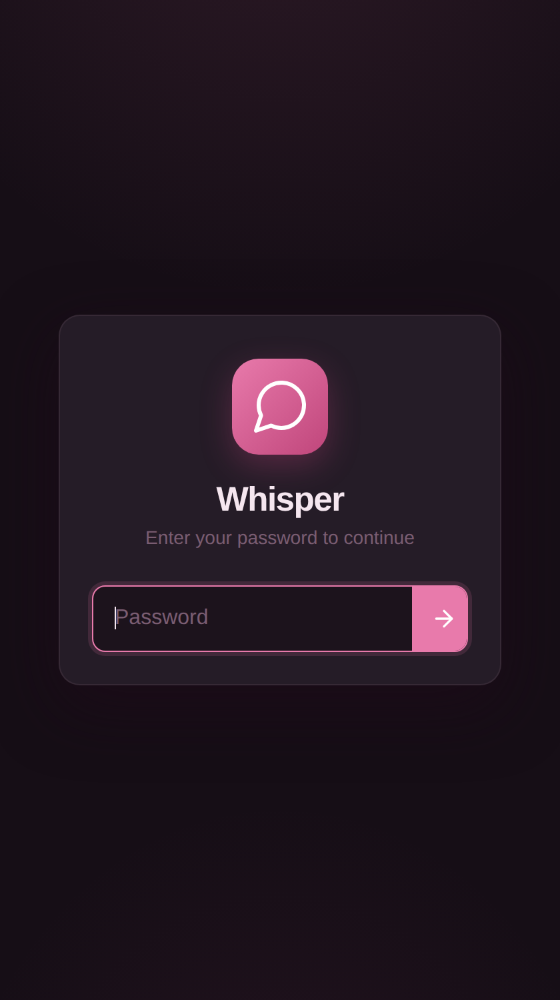
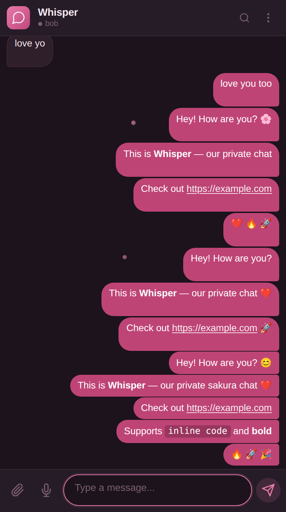
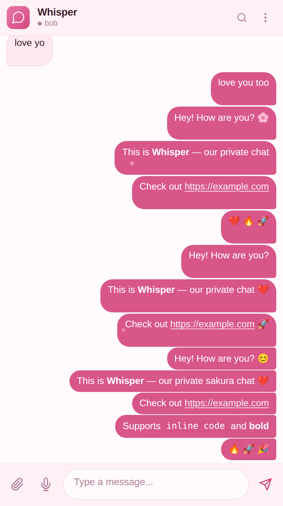
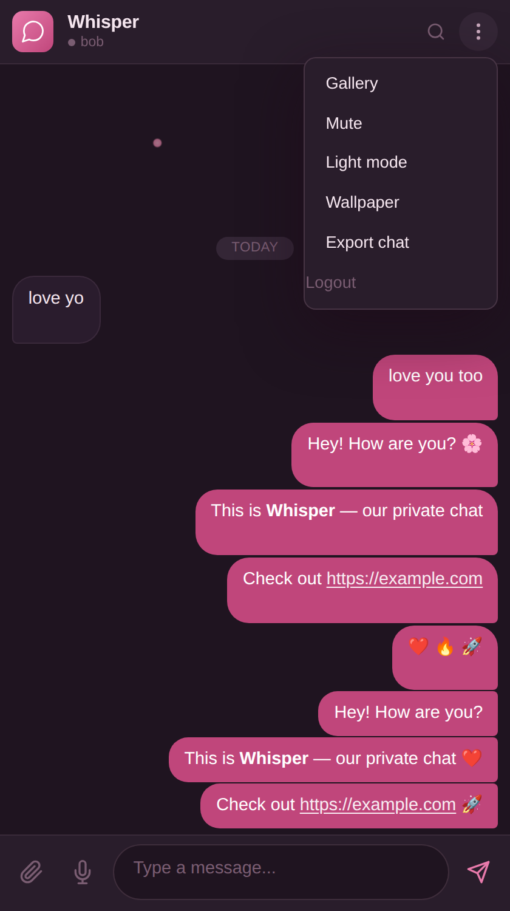

# Whisper

Private self-hosted group chat. Sakura Falls theme.


## Screenshots

<p align="center">
  
  
  
  
</p>

## Features

**Chat**
- Real-time messaging via WebSocket
- Markdown rendering (`**bold**`, `*italic*`, `` `code` ``, `~~strike~~`)
- Clickable links
- Emoji shortcodes (`:smile:` `:heart:` `:fire:` etc.)
- Typing indicator with auto-timeout
- Read receipts (checkmarks)
- Message reactions (right-click or long-press)
- Reply to messages
- Delete your own messages
- Search messages
- Message history with infinite scroll

**Media**
- Image/file/audio upload with drag & drop
- Clipboard paste (Ctrl+V images)
- Voice messages (browser recording)
- Image lightbox viewer
- Media gallery

**Security**
- Password-only login (no username needed)
- Argon2id password hashing
- Encrypted SQLite database (SQLCipher)
- Session-based auth with CSRF protection
- Rate-limited login (5 attempts/min/IP)
- Security headers (CSP, X-Frame-Options, etc.)
- WebSocket rate limiting (20 msg/sec)
- Auto-logout after 1 hour idle
- Failed login attempt logging

**UI/UX**
- Sakura Falls theme (dark + light)
- Falling cherry blossom petals animation
- Custom wallpaper support
- PWA installable
- Mobile responsive
- Browser notifications
- Notification sound (toggleable)
- Offline message queue
- Chat export (JSON)

## Quick Start

```bash
# Clone
git clone https://github.com/dhava-gautama/whisper.git
cd whisper

# Run (requires Go 1.22+ and gcc for SQLCipher)
WHISPER_USER1_PASS=your_password_1 \
WHISPER_USER2_PASS=your_password_2 \
WHISPER_DEV=true \
go run .
```

Open `http://localhost:8080` and enter either password to login.

## Deployment

### Option A: Docker + Caddy (auto-TLS)

```bash
cp .env.example .env
nano .env                    # set passwords + DB key

# Edit Caddyfile with your domain
nano Caddyfile

docker compose up -d
```

Caddy handles TLS automatically via Let's Encrypt.

### Option B: Docker + Cloudflare (recommended)

If you use Cloudflare for DNS, you can skip Caddy entirely and expose Whisper directly behind Cloudflare's proxy.

1. **`docker-compose.yml`** — remove the caddy service, expose whisper directly:

```yaml
services:
  whisper:
    build: .
    container_name: whisper
    restart: unless-stopped
    ports:
      - "8080:8080"
    env_file: .env
    volumes:
      - whisper_data:/app/data

volumes:
  whisper_data:
```

2. **`.env`** — add your passwords:

```
WHISPER_USER1_PASS=your_password_1
WHISPER_USER2_PASS=your_password_2
WHISPER_DB_KEY=your_encryption_key
```

3. **Cloudflare Dashboard**:
   - Add an A record pointing to your server IP
   - Enable the orange cloud (proxy)
   - SSL/TLS mode: **Full (strict)** if you have an origin cert, or **Full**
   - Under Network: enable **WebSockets**

4. **Cloudflare Tunnel** (alternative — no open ports needed):

```bash
# Install cloudflared
cloudflared tunnel create whisper
cloudflared tunnel route dns whisper whisper.yourdomain.com

# Run tunnel
cloudflared tunnel --url http://localhost:8080 run whisper
```

5. **Start**:

```bash
docker compose up -d
```

> **Important**: When using Cloudflare proxy, set `WHISPER_DEV=true` in your `.env` so cookies work over HTTP between Cloudflare and your origin. Cloudflare terminates TLS at the edge, so the connection to your server may be HTTP internally. Alternatively, set up a Cloudflare origin certificate for full end-to-end encryption.

### Option C: Bare metal

```bash
# Build
go build -o whisper .

# Run
WHISPER_USER1_PASS=pass1 WHISPER_USER2_PASS=pass2 ./whisper

# Or with systemd
sudo cp whisper /usr/local/bin/
sudo nano /etc/systemd/system/whisper.service
sudo systemctl enable --now whisper
```

## Configuration

### Users (`users.json`)

Create a `users.json` file with your users (supports any number of users):

```json
[
  {"name": "alice", "password": "secure_password_1"},
  {"name": "bob", "password": "secure_password_2"},
  {"name": "charlie", "password": "secure_password_3"}
]
```

Each user logs in with just their password — no username needed. Passwords are hashed with Argon2id at startup and never stored in plaintext.

> **Backward compatible**: If no `users.json` exists, falls back to `WHISPER_USER1_PASS` / `WHISPER_USER2_PASS` environment variables (2-user mode).

### Environment Variables

| Variable | Default | Description |
|----------|---------|-------------|
| `WHISPER_ADDR` | `:8080` | Listen address |
| `WHISPER_USERS_FILE` | `./users.json` | Path to users config |
| `WHISPER_DB_PATH` | `./data/whisper.db` | SQLite database path |
| `WHISPER_DB_KEY` | *(empty)* | SQLCipher encryption key |
| `WHISPER_MEDIA_DIR` | `./data/media` | Media storage directory |
| `WHISPER_MAX_UPLOAD_MB` | `50` | Max file upload size in MB |
| `WHISPER_SESSION_TTL` | `24h` | Session lifetime |
| `WHISPER_DEV` | `false` | Dev mode (disables secure cookies) |

## Architecture

```
Browser A ←WSS→ [Caddy/Cloudflare] ←→ [Go Server] ←→ [SQLite + Files]
Browser B ←WSS→
Browser C ←WSS→
```

- Single Go binary (12.5 MB)
- Frontend: 97 KB total (vanilla HTML/CSS/JS)
- Runtime RAM: ~2 MB
- 5 Go dependencies, everything else is stdlib
- SQLite with WAL mode for concurrent reads

## Project Structure

```
whisper/
├── main.go                 # Entry point, router, handlers
├── internal/
│   ├── auth/               # Argon2, sessions, rate limiter, middleware
│   ├── chat/               # WebSocket hub + handler
│   ├── config/             # Environment configuration
│   ├── db/                 # SQLite operations + migrations
│   └── media/              # File upload/download
├── web/
│   ├── index.html          # Login page
│   ├── chat.html           # Chat interface
│   ├── css/style.css       # Sakura Falls theme
│   ├── js/login.js
│   ├── js/chat.js          # All chat logic
│   ├── favicon.svg
│   ├── manifest.json       # PWA manifest
│   └── sw.js               # Service worker
├── Dockerfile
├── docker-compose.yml
├── Caddyfile
└── .env.example
```

## API Endpoints

| Method | Path | Auth | Description |
|--------|------|------|-------------|
| `POST` | `/api/login` | No | Login with password |
| `POST` | `/api/logout` | Yes | End session |
| `GET` | `/api/messages` | Yes | Message history (paginated) |
| `GET` | `/api/messages/search?q=` | Yes | Search messages |
| `GET` | `/api/messages/export` | Yes | Download chat as JSON |
| `POST` | `/api/media/upload` | Yes | Upload file |
| `GET` | `/api/media/{id}` | Yes | Download file |
| `GET` | `/api/media` | Yes | List all media (gallery) |
| `GET` | `/api/version` | No | Server version |
| `GET` | `/api/storage` | Yes | Storage usage |
| `GET` | `/ws` | Yes | WebSocket connection |

## WebSocket Protocol

Messages are JSON over WebSocket.

**Client sends:**
```json
{"type": "message", "content": "Hello!", "media_id": null, "reply_to_id": null}
{"type": "typing", "is_typing": true}
{"type": "reaction", "message_id": 42, "emoji": "👍"}
{"type": "delete", "message_id": 42}
{"type": "read", "last_read_id": 42}
```

**Server sends:**
```json
{"type": "message", "id": 1, "user": {"id": 1, "username": "alice"}, "content": "Hello!", ...}
{"type": "typing", "user": {...}, "data": {"is_typing": true}}
{"type": "presence", "user": {...}, "data": {"online": true}}
{"type": "reaction", "id": 42, "data": {"reactions": [...]}}
{"type": "delete", "id": 42}
{"type": "read", "user": {...}, "data": {"last_read_id": 42}}
```

## License

MIT
